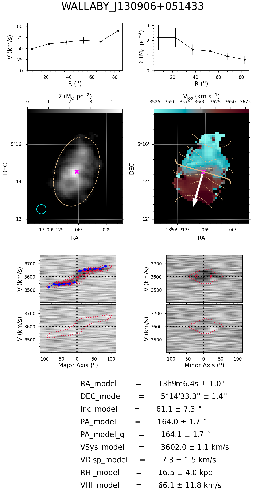

3KIDNAS Outputs
=================================

There are a variety of data products produced by 3KIDNAS.  When run in pipeline mode, there are a set of products produced for each galaxy regardless of whether the fit is acceptable.  These products are stored in individual folders for each galaxy.  

After fitting all galaxies, 3KIDNAS checks whether the fits are acceptable.  All accepted fits are stored in a subfolder.  Within this subfolder, individual folders are made for each galaxy.  Additionally a catalogue file is generated contains the model parameters for all successful fits. And, for ease in browsing, copies of all diagnostic plots are placed in a separate folder (both for all fits and for only the accepted fits).  Essentially the structure is:

| MainOutputFolder
| ├── AcceptedGalaxyModels
| │   ├── CatalogueFile
| │   ├── DiagnosticPlotFolderForAcceptedFits
| │   ├── AcceptedGalaxy1
| │   └── AcceptedGalaxy2
| │   └── ...
| ├── DiagnosticPlotFolderForAllFits
| ├── README.md
| ├── AttemptedGalaxyFit1
| └── AttemptedGalaxy2
| └── ...    

The AcceptedGalaxyModels folder contains all acceptable models.  Within that folder, the catalogue file is the single most important 3KIDNAS output.

Accepted Model Catalogue
--------------
The accepted model catalogue is the most important output from 3KIDNAS as it is the one that users will likely interact with the most.  It contains the model parameters for each individual galaxy fit.  While this information is available in the individual output folders, it is much more accessible in the output csv catalogue.  The various columns in the catalogue are

.. csv-table:: The 3KIDNAS Catalogue File Columns
   :file: KIDNAS_CatalogueColumnName.csv
   :widths: 30, 70
   :header-rows: 1

Diagnostic Plots
--------------
3KIDNAS produces a diagnostic plot for every galaxy that it models.  An example of such a plot is:

